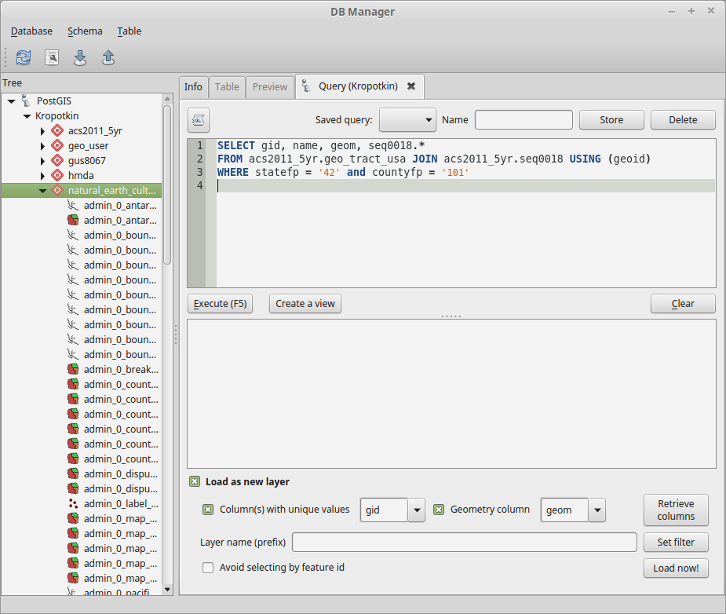

Overview
========

-   Connect to a PostGIS Server
-   Save an extract from a larger dataset
-   Examine migration data
-   Map a calculated field

Data
====

Census data sets can be large and unwieldy. It is often useful, therefore, to maintain the data in a real database server. The Geography & Urban Studies Department maintains such a database. This database is only available from on campus. Prof. Hachadoorian will demonstrate how to connect to the database in class.

Once the database is connected, you can investigate the available tables using DB Manager.

Exand the PostGIS branch, then the Kropotkin branch. You will see a list of “schemas”, which are containers for spatial layers and database tables. Expand the `natural_earth_cultural` schema. You will see a list of countries, states and provinces, parks, railroads, etc. You can also expand the `acs2011_5yr` schema, although because of the large number of tables, it will probably take half a minute to load.

After inspecting the database schemas, we are going to load ACS data using a database query. The advantage of doing this is that:

1.  We will filter the data so as to only load tracts in Philadelphia, instead of in the entire US.
2.  We will join the demographic data we are interested in on the server, instead of using the join dialog in QGIS.

Paste the following code into the query window (upper pane):

``` sql
SELECT gid, name, geom, seq0018.* 
FROM acs2011_5yr.geo_tract_usa JOIN acs2011_5yr.seq0018 USING (geoid)
WHERE statefp = '42' and countyfp = '101'
```

You can execute the query to see the results, but we are interested in loading it into QGIS. Enable the following settings:

-   Check Load as new layer
-   Set Column(s) with unique values to `gid` (you may have to enable the checkbox)
-   Set Geometry column to `geom` (this may already be the default)

See the picture below. Once the settings are right, click the Load now! button.

 

After loading this data, you may want to save it for use locally. You can do this by right-clicking on the layer and choosing Save As. The shapefile format is widely supported, so you might select that. You might also experiment with SpatiaLite, which you have already used.
